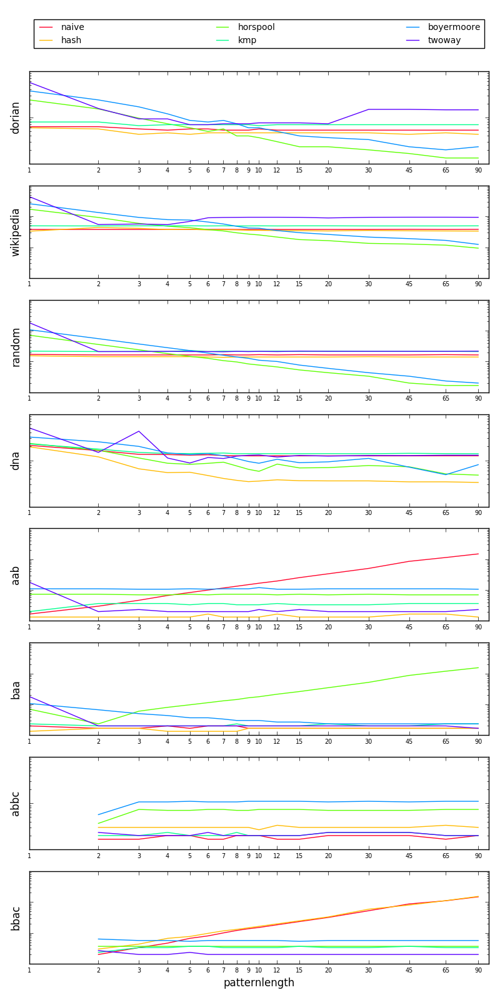

# Benchmark of string searching algorithms in OCaml

## Usage

```sh
./download.sh
ocamlbuild benchmark.native
./benchmark.native > benchmark.csv
./plot.py
```

## Algorithms

* Naive brute-force algorithm
* Hash algorithm: Rabin-Karp with the sum of the characters as hash sum
* Horspool algorithm
* Knuth-Morris-Pratt algorithm
* Boyer-Moore algorithm
* Twoway algorithm

## Benchmarks

* A copy of _The Picture of Dorian Gray_
* A list of Wikipedia articles related to functional programming
* A string of random characters
* Part of the human genome
* Searching for `AAAA...AAAB` in `AAAA...AAAA`
* Searching for `BAAA...AAAA` in `AAAA...AAAA`
* Searching for `ABBB...BBBC` in `BBBB...BBBB`
* Searching for `BBBB...BBAC` in `BBBB...BBBB`

## Results


